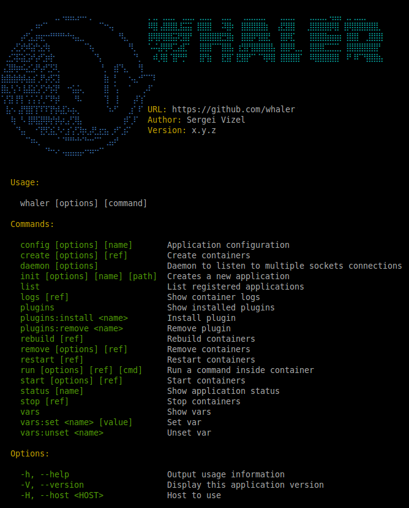

# Whaler



## Install

```sh
$ curl -sSL https://git.io/whaler-install | sudo sh
```

OR

```sh
$ curl -sSL https://git.io/whaler-install | sudo sh -s -- --version=latest
```

## Run app

```sh
$ whaler
```

## License

This software is under the MIT license. See the complete license in:

```
LICENSE
```
